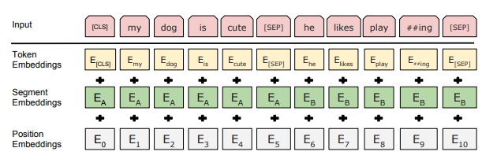

### Problem Definition

Adversarial attacks are the phenomenon in which machine learning models can be tricked to make false predictions by slightly modifying the input. There is not a lot of research that happened on comparing the effect of one attack on multiple models as well as the multiple datasets. So, we have studied the effect of an adversarial attack (TextFooler) on multiple BERT-based NLP models on both IMDB and Yelp datasets and proposed an ensemble defense solution.

### Motivation
There is sample literature exploring adversarial attacks on image deep neural networks (DNN) systems for object detection systems. Comparisons and trade-offs between different proposed attack types have been made and documented regularly over the past years. However, when it comes to adversarial attack effects on BERT NLP models, comparison surveys are scarce and sparse. Our primary motivation to perform this analysis is the fact that it is an area which hasn't been thoroughly explored yet. The insights that will be gained from our study will help both the designers of adversarial attacks to strengthen their methods in the future and to identify specific weaknesses in a BERT based text classification model. We also hope to make informative deductions based on the different datasets that will be used during experimentation.

### BERT Architecture
BERT stands for Bidirectional Encoder Representations from Transformers. It is a deep learning based unsupervised language model developed by researchers at Google AI. 


<!--  -->

*What is meant by bidirectional?*

Up until the conception of BERT, all models either read sentences from left to right or right to left which limited the context in which each word of the sentence was viewed. BERT is bidirectional or more precisely non-directional as it considers all surrounding words as context without being biased to any direction.


BERT uses the transformer architecture, but only the encoder part of it. BERT also has a very unique way of representing embeddings. Apart from token embeddings which are somewhat common across all NLP applications, there are also segment and position embeddings. Segment embeddings indicate which sentence the current token is part of. Position embeddings indicate the relative position of the token in the entire sequence. Like I mentioned before, BERT doesn’t use the decoder of the transformer architecture. Instead, in the text classification case for example, the classifier layer acts as a decoder. Another salient feature of BERT is that is uses the masked LM strategy. This means that 15% of the tokens are masked and BERT predicts these tokens on the basis of their surrounding unmasked tokens.

### Proposed Design


The design takes into account various component which are called Models in our project. One is DataSet Model that will return different type of dataset we want to train our model. Next is the our Attack Model in which we define our TextFooler attack. We have a Transformer that loads Auto Tokenizer and Model to attack which then is passed onto the HuggingFace ModelWrapper used for this project. We then build the model on the attack and run our attacker model for final evalution.


### TextFooler
TextFooler is an adversarial attack technique which identifies the most important words in the input data and replaces them by grammatically correct synonyms. What is meant by the importance of a word in this case? The words which contribute most to the label or class of the sentence are relatively more important than others. The TextFooler attack operates in 2 steps, one is the identification of the important words and the second is replacement. The replacement process is further broken down into 3 steps. First, a synonym of the important word is sampled. This includes a ranking system to check which synonym fits best. Next, part-of-speech checking is carried out to make sure that the identified synonym fits grammatically correctly in the said sentence. Finally semantic similarity checking is performed, where the semantic structure of the adversarial example is compared to the original sentence.

Here is an example as quoted in the paper. The first sentence is classified as negative. The TextFooler model identifies that the words contrived, situations and totally might be the most contributing words to this label. It then replaces these words as shown and the classifier model ends up classifying this new sentence with a positive label.


### IMDB Movie Reviews Dataset
The [IMDB Dataset](https://huggingface.co/datasets/imdb) has 50k movie reviews for natural language processing or Text Analytics. This dataset is for binary sentiment classification containing substantially more data than the previous bench marks datasets. It contains a set of 25k highly polar movie reviews for training and 25k for testing.

* **49,582** unique reviews

* **12,500** reviews with sentiment positive

* **12,500** reviews with sentiment negative

* **80.23 MB** Dataset Size

### Snippet of Data Samples and Labels

|  **Review**                                                                                            |  **Sentiment** |                         
|--------------------------------------------------------------------------------------------------------|----------------|
|One of the other reviewers has mentioned that after watching just 1 Oz episode you'll be hooked. The... | positive
|A wonderful little production. <br /><br />The filming technique is very unassuming- very old-time-B... | positive
|Basically there's a family where a little boy (Jake) thinks there's a zombie in his closet & his par... | negative
|This show was an amazing, fresh & innovative idea in the 70's when it first aired. The first 7 or 8 ... | negative

### Yelp Review Sentiment Dataset
The [Yelp Dataset](https://huggingface.co/datasets/yelp_polarity) consists of reviews from Yelp. It is extracted from Yelp Dataset challenge 2015 data. This dataset is for binary sentiment classification consisting with 598k highly polar yelp reviews out of which 560k are for training and 38k are for testing. This dataset is constructed by considering stars 0-2 as negative, and 3-4 as positive. Negative polarity is class 1 and positive polarity is class 2.

* **37,999** unique reviews

* **2,80,000** reviews with sentiment positive

* **2,80,000** reviews with sentiment negative

* **158.67 MB** Dataset Size

### Snippet of Data Samples and Labels

|  **Review**                                                                                            |  **Sentiment** |                         
|--------------------------------------------------------------------------------------------------------|----------------|
|Last summer I had an appointment to get new tires and had to wait a super long time. I also went in ... | 1
|Friendly staff, same starbucks fair you get anywhere else. Sometimes the lines can get long.            | 2
|The food is good. Unfortunately the service is very hit or miss. The main issue seems to be with the... | 1
|Even when we didn't have a car Filene's Basement was worth the bus trip to the Waterfront. I always ... | 2

### Analysis on Text fooler attack performance
Text fooler attack performance can be varied based on different parameters like similarity threshold, word embedding distance, number of perturbed words etc. As part of this project, a study on text fooler attack performance is performed under different settings like max number of perturbed words, word embedding distance, allowed similarity of adversarial sentence by cosine similarity, under pre-transformations and search methods.

### Percentage of Max words perturbed
Max words perturbed constraint basically represents a maximum allowed percentage of the perturbed words to the overall words. With increase in perturbation, there would be a significant change in the characters in the words or even the whole words which would result in misclassification by the model. As we can undrestand, model accuracy under the attack reduces. Below table shows the accuracy under attack(%) and average perturbed word(%) by tweaking Max words perturbed for IMDB dataset.

|Max_Words_Perturbed(%)|Accuracy under attack(%)|Average perturbed word(%)|
|----------------------|------------------------|-------------------------|
|       0.0001         |        60              |      0                  |
|       0.01           |        60              |      0                  |
|       0.75           |        10              |      28.86              |

### Levenshtein Distance -- Similarity between two sentences
The text fooler selects the adversarial examples based on the maximal sentence similarity only over a certain threshold. It employs levenshtein distance (number of deletions, insertions or substituions required to transform the original review to the review after attack) to select the adversarial example. With other constraints constant, we evaluated the accuracy of model by varying the levenshtein distance. Below table shows the accuracy under attack(%) and average perturbed word(%) by tweaking levenshtein distance.

|Levenshtein distance|Accuracy under attack(%)|Average perturbed word(%)|
|--------------------|------------------------|-------------------------|
| 12                 |        0              |      9.37                |
| 30                 |        40              |     1.41                |
| 50                 |        45              |     0.83                |

### Pre-transformations
Pre-transformations include inserting spaces or a character at the beginning or at the end and also deleting characters, to change the context of the sentence that can potentially lead to the misclassification by the model. We observd that such pre-transformations aid the attacking efficieny and result in decreasing the model accuracy under attack. Below table shows the accuracy under attack(%) and average perturbed word(%) before and after the pre-transformations.

|Pre-transformations|Accuracy under attack(%)|Average perturbed word(%)|
|-------------------|------------------------|-------------------------|
| Before            |        70              |     0.38                |
| After             |        20              |     1.1                 |

### Search Methods
We observed that by varying the search methods from greedy search to greedy-word-swap, the model accuracy under attack will be affected. Greedy search method chooses from a list of possible perturbations greedily. This is implemented by calling "Beam search" with beam_width set to 1 where as greedy-word-swap greedily chooses from a list of possible perturbations in the order of index, after ranking indices by importance. It uses wir method for ranking the importance. Below table shows the accuracy under attack(%) for greedy search and greedy word swap search methods.

|Search method      |Accuracy under attack(%)|
|------------------ |------------------------|
| Greedy search     |        60              |  
| Greedy word swap  |        70              | 

### Modelling of BERT Models and evaluating with TextFooler

We analyzed various Bert Models on two dataset mainly YELP Polarity and IMDB. The diagram gives a brief idea of different Bert Models used. Most of these models have been fined tuned on some particular dataset like Bert on Amazon polarity has only been trained on Amazon Polarity dataset. We tried to use such models also for our attack analysis to see how well these attack model works on models which have been trained on a particular dataset.


#### Training Summary of BERT Models
Traning of these models was one of the most importasnt part of this project and we did spend fair amount of time on that. Following are the details on how our training of these Bert Model took place:

|System Paramter            |                                                              |
|---------------------------|--------------------------------------------------------------|
| Transformer Library       |        Hugging Face                                          |  
| Training Enviroment       |        Colab/Kaggle                                          | 
| Compute Used.             |        GPU P100                                              |  
| Training HyperParameter   |        BatchSize, Epochs, Label Number, Max Sequence Length  | 
| Evalution Size            |        100                                                   |
| Attack Sample size        |        100                                                   | 

Following is the table for Training HyperParameter used:

|Training Hyper Paramter            |    Value                                                     
|-----------------------------------|--------------|
| Batch Size                        |      128     |  
| Number of Epoch                   |      3       | 
| Number of Label                   |      2       | 
| Max Sequence Length               |      64/2480 |


#### Accuracy Analysis (YELP and BERT)


|Model                      |Accuracy before attack(%)|Average after attack(%)  |Run Time|
|---------------------------|------------------------ |-------------------------|-------------------------|
| Bert on YELP Polarity     |        92.78            |     8.00                |  4 hr 30 min            |
| RoBERTa base              |        94.27            |     6.00                |  3 hr                   |
| XLnet BERT                |        93.93            |     4.00                |  3 hr 30 min            |
| Distil RoBERTa            |        93.6             |     2.00                |  1 hr 33 min            |
| BERT on Amazon Polarity   |        93.28            |     1.00                |  3 hr                   |
| BERT uncased              |        92.9             |     0.2                 |  2 hr 30 min            |
| BERT cased                |        93.08            |     0.0                 |  3 hr                   |
| AlBERT base               |        91.00            |     0.0                 |  3 hr                   |
| Tiny BERT                 |        88.34            |     0.0                 |  17 min                 |
| BERT multilingual         |        91.59            |     0.0                 |  1 hr 49 min            |


### Ensemble Model

### Experimental Results

### Easy case
* We consider the easy case as when the attacking is benign or not sufficient enough to misguide the models. Below shows the models classifying the sentence correctly marking the attack as failed

* Bert-base-uncased


* Alberta-base-cased


* Roberta-base


### Hard case
* Hard case is considered when the attacking is clever with replacing the words and misguiding the models
* However, the humans can observe the overall context of the sentences is preserved and can classify correctly illustrating the hardness of the attack. Below shows the samples of such attacking examples misclassifed by the considered models

* Bert-base-uncased


* Alberta-base-cased


* Roberta-base


### Medium case - When few of the models used in ensemble failed to defend the attack
Bert-base-uncased

Alberta-base-cased

Roberta-base


<!-- ### Data snippet

|  **Review**   |  **Sentiment**    |                          |
|-----------|------------|----------|-----------|--------------------------|------------------------------------|
|  250..48  |  SOAK..95  | 1        |  TRIQ..D  |  Jack Johnson            |  The Cove                          |
|  250..48  |  SOFR..C0  | 1        |  TRDM..1  |  Harmonia                |  Sehr kosmisch                     |
|  250..48  |  SOJT..3D  | 1        |  TRVM..4  |  Gipsy Kings             |  Vamos A Bailar                    |
|  250..48  |  SOYH..7F  | 5        |  TRVP..8  |  Jack Johnson            |  Moonshine                         |
|  250..48  |  SOAX..A1  | 1        |  TRHK..F  |  Florence + The Machine  |  Dog Days Are Over (Radio   Edit)  |
|  250..48  |  SODJ..CE  | 1        |  TRVC..6  |  Train                   |  Hey_ Soul Sister                  |
|  250..48  |  SONY..C9  | 5        |  TROA..3  |  OneRepublic             |  Secrets                           |
|  250..48  |  SORM..95  | 1        |  TRJY..F  |  Jorge Gonzalez          |  Esta Es Para Hacerte Féliz        | -->

### Technology Stack
* Used Spark framework over Hadoop MapReduce - which is an iterative algorithm. Each iteration requires a hadoop job which involves continuous reading and writing to the disk which becomes a bottleneck. Spark loads user-song matrix in memory and caches it. 

* Used Amazon Cloud Storage S3  over HDFS for storing the dataset because of its elasticity, better availability and durability, 2X performance and its lower cost.

### Cosine Similarity using MapReduce

This approach uses item-item collaborative filtering to provide the recommendations for a user.  All the compute intensive tasks are split between mapper nodes and the data is collected and collated by the master or reducer code. Hence, Map reduce. The same is implemented using spark.

We used item-item collaborative filtering over user-user collaborative filtering for a number of reasons:

* Performance: It performs better than user-user similarity and hence is a popular choice for high load services.
* Cold start problem: Item-item collaborative filtering handles the cold start problem better as when a new user enters into the system, he can be asked to choose a few songs he finds interesting and based on our pre-computed data for song-song similarity we can recommend similar songs to the user. 
* Number of computations: The number of songs is lesser than the number of users in our dataset. Hence, the number of computations is much lesser for item-item collaborative filtering approach  
* Item-item similarity remains more constant as opposed to user-user similarity which changes frequently. 
* Accuracy: In item-item approach as the recommendations are more accurate.
* Security: Resistance of this approach to shilling attack. Shilling attack is where the attackers try to manipulate recommendations by adding user-rating content maliciously. Here again its based on the user’s choice himself it is resistant to shilling attacks. 


### Cosine Similarity using MapReduce - Architecture


The basic methodology includes two steps: 
* data transformation
* cosine similarity algorithm application
 
We started with the data set consisting of user, song and rating information. We calculated all the pairs of songs listened by the users and the corresponding ratings of songs. This is done for all the users and all the songs they have listened to. Once we have this list consisting of song pairs and rating pairs, for each song pair we form a vector of ratings pairs collected by a number of users. Next the cosine similarity algorithm is applied on this vector to find the similarity score of the song pair.	

While providing the recommendation for a user, we consider the user’s top songs and recommend other songs which are similar to his listening history. Further, we apply other filters like similarity score greater than certain threshold, song pair appearance > certain count to make the recommendations more relevant. We are using implicit data that is the song count and normalizing it. Ideally cosine similarity works better with explicit data, however due to lack of dataset with this information we used implicit data.


### More about Cosine Similarity

#### Data shuffling issue
In item-item collaborative filtering each mapper node contains information about a subset of items. Hence, during different item-item calculations it  requires shuffling of item data over different worker nodes. This data shuffling is a very expensive operation and hence slows down the process.


### Cosine Similarity code snippets
* Data Transformation

```
rdd = sc.textFile(data_path)\
            .map(lambda x: x.split(",")).map(lambda x : ((x[1]),(x[2],x[3]))) 
songpair = rdd.join(rdd)
songpair_withoutdups = songpair.filter(remove_duplicates)
just_songpairs = songpair_withoutdups.map(justsongpairs)
groupOfRatingPairs = just_songpairs.groupByKey()
songPairsAndSimilarityScore = groupOfRatingPairs.mapValues(findCosineSimilarity)
```

* Cosine Similarity Algorithm

```
    for pair in rdd:
        X, Y = pair
        ratingX = float(X)
        ratingY = float(Y)
        xxsum = xxsum + ratingX*ratingX
        yysum = yysum + ratingY*ratingY
        xysum = xysum + ratingX*ratingY
        num_of_pairs = num_of_pairs+1
    
    denom = 0.0 + math.sqrt(xxsum)*math.sqrt(yysum)

    result = 0.0 + xysum/denom
    return (result,num_of_pairs)
```

* Algorithm to find top recommendations for a user

```
    for song in top5_songs:
        song_id = song
        filteredsongSimilarity = songPairsAndSimilarityScore.filter(filterOnThreshold)
        top10 = filteredsongSimilarity.take(10)
        top50.extend(top10)
    top50.sort(key = lambda x: x[1][0])
    top50 = top50[0:20]
    already_displayed.clear()
    for song in top5_songs:
        song_id = song
        displayTop10(top50,song_id)
```

### Recommendations from Cosine Similarity


This the recommendation results which we obtained from map reduce approach for the same user which we considered in ALS approach. We observed that the recommendations we obtained from both the approaches were similar in terms of artists, genre etc. And we got 3 out of top 5 recommendations to be exactly similar.  


### Friend based collaborative filtering

As observed from previous experiments and results, user-based and item-based Collaborative Filtering is computationally expensive, hence this enabled us to explore other solutions for large scale collaborative filtering.

Friend-Based CF is based on the assumption that an individuals taste/liking is strongly influence by the people around him. It is more likely that an individuals taste in music is more similar to his friend rather than a stranger in a different country. Hence, if we can define these relations and form smaller cluster then it is possible to use CF to compare an individual only to his friends and connections in order to determine similarity. This would reduce the computation time as the number of people per cluster would be significantly less and not every user needs to be compared to every other user. Hence, a friend based collaborative filtering would be more efficient, accurate and scalable. 


### Friend based collaborative filtering - Architecture


The main component here is the Clustering algorithm - We have used a graph algorithm (BFS) to identify an users 2nd degree connections from the dataset and formed smaller clusters. Once the smaller clusters are formed, the complete set of users in a cluster and the songs they listen to can be sent to individual worker nodes to calculate the user-similarity matrices per cluster and then sent back to the master for recommendations.

Advantages of Friend-Based Collaborative Filtering:

1) Efficient: Since the computations are done for a smaller cluster now, the computation time per user is very low as there are very few user-user comparisons. Additionally, since the complete set of users per cluster along with their music ratings is cached on the worker node, there is no data shuffling between the workers and hence IPC time is saved. 

2) Cold Start Problem: When a new user with limited data is added to the system, he can be recommended songs based on what his/her friends like. This would help to address the cold-start problem.

Hence, this method overcomes the cost problems like that of normal Memory-based CF and also overcomes the cold start problem of ALS and hence should be a more viable and efficient solution.


### Friend based collaborative filtering - Algorithm

* Create a list of all artist count
* Remove all artists that the user has already seen
* Initialize all artists weight count to 0
* Get top 10 users most similar to the particular user
* For each of the 10 users –
  - Get all artists listened to by the user
  - Multiply the listen count for each artist with the similarity score of the user
  - Add this user weight to the overall weight of the artist
* After amplifying the listen count using all closest users, fetch the top 5 artists with the highest updated weight

```
graph = dict()

def addLinks(df, graph):
    graph[df['userID'].iloc[0]] = set(df['friendID'])
    return

df.groupby('userID').apply(addLinks, graph = graph)


def get_all_connected_groups(graph):
    already_seen = set()
    result = []
    for node in graph:
        if node not in already_seen:
            connected_group, already_seen = get_connected_group(node, already_seen, graph)
            result.append(connected_group)
    return result


def get_connected_group(node, already_seen, graph):
    result = []
    already_seen.add(node)
    result.append(node)
    nodes = graph[node]
    while nodes:
        node = nodes.pop()
        if node in already_seen:
            continue
        already_seen.add(node)
        result.append(node)
        nodes = nodes | graph[node]
    return result, already_seen


def get_second_degree(graph, userID):
    nodes = graph[userID]
    result = set()
    r = set()
    for node in nodes:
      result.update(graph[node])
      r.update(graph[node])
    return result
```

### Evaluation Results

#### ALS Experimentation Results


We can see how the training time of the algorithm decreases with increasing number of nodes in the cluster.

The second graph shows the time taken to calculate the RMSE on the test data vs the number of nodes in the cluster. It is visible here as well how the time taken decreases along with the increasing number of nodes in the cluster.


The above images show the execution of the tasks performed by spark along with the number of cores used and how the tasks are parallelized.

#### Cosine Similarity Experimentation Results


| No of Nodes | Time Taken(sec) | Time Taken(sec) |
|-------------|-----------------|-----------------|
|             | 48M rows        | 1M rows         |
| 4           | -               | 101             |
| 8           | ~6300           | 57              |

#### Result Analysis

Fig: Training + prediction times for 10 million rows on 2,4,6 and 8 nodes on cluster
The entire dataset - 48M rows couldn’t be processed on our cluster with 2, 4 or 6 nodes (8GB RAM each) because of the executor running out of memory. This  was leading to the cluster disconnecting abruptly.
We could only calculate the item-item similarity on the entire dataset by using 8 nodes of 16GB RAM each which took a high computation time of around 6300s.
The results do not linearly scale up when compared to a smaller dataset of 1M rows because of polynomial increase in number of shuffles and comparisons (n^2 comparisons) and increased IPC overhead during data shuffling. The join operation time increases quadratically (n^2) with dataset size.  


#### ALS Vs MapReduce

|                     | Time taken for 8 nodes |
|---------------------|------------------------|
| ALS                 | ~791                   |
| Cosine - Similarity | ~6308                  |

#### Friend based Experimentation Results

We carried out a small POC to prove that the accuracy of recommendations remain unhampered  even if not all users are used in the similarity matrix computation.

We took a user-artist dataset, which includes rating of an user for different artist. This dataset also included a user-friend datafile, which described the friends a particular user has. We used this data file to create small clusters using our graph algorithm.

Once the smaller clusters were obtained, we carried out the following experiment:

For user 128, we computed the similarity matrix considering all the users of the dataset (2000 users).
The top 10 most similar users were - 1210, 1866, 374, 1643, 1209, 428, 1585, 176, 196, 788

For user 128, we computed the similarity matrix considering only the users in his cluster (250 users).
The top 10 most similar users were - 1210, 1866, 374, 1643, 1209, 428, 1585, 176, 196, 666

10-most similar users in both scenarios:


As observed from the Venn Diagram above - 9 out of 10 users are similar in both the cases. Hence, we can say that a smaller subset cluster would be better/equivalent to using the whole dataset consisting all users.

General recommendations for different cases using Friend-Based CF


Disadvantages of Friend-Based CF

People with limited friends i.e., smaller clusters still face the cold-start problem (as seen above for the hard case).
Several other factors like geographic location, state of mind etc. can influence a person’s taste of songs.

### Conclusion

We found out that ALS based on Matrix Factorization is one of the most efficient Distributed algorithm available which works well for implicit data and explicit data as well. But the main disadvantage it suffers from is the Cold-Start problem for new users.

So, we recommend a Social Recommendation approach using Friend-Based Collaborative Filtering. This significantly reduces the number of user-user comparisons and using an ALS like architecture, which reduces the IPC cost, it makes this approach more efficient, accurate and more scalable.

### Lessons Learned

* Handling Huge Datasets - We worked with BigData and a dataset of size 5GB for the first time. We dealt with problems of data cleaning and combing different parts of the dataset to obtain a usable dataset.
* Learnt about different algorithms used in Collaborative Filtering (Both Memory based and model based).
* Worked/learned about distributed architecture for Recommendation Systems.
* Understood how Spark and mapReduce frameworks internally work.
* Learned working with Spark clusters on cloud (AWS).
* Learned about different clustering techniques to form smaller clusters.
* Finally, enjoyed collaborating with team, the fruitful discussion and collectively working towards achieving a common goal.

### Future Work

We would like to:
* Carry out more experiments to prove efficacy of Friend-Based CF in terms of training time on larger datasets.
* Explore Hierarchical Agglomerative Clustering to form clusters instead if simple graph based algorithms.
* Look into different metrics to quantify results to compare efficiencies of different approaches.

### References

[1] Rohit and A. K. Singh, "Scalable recommender system based on MapReduce framework," 2017 IEEE International Conference on Power, Control, Signals and Instrumentation Engineering (ICPCSI), 2017, pp. 2892-2895, doi: 10.1109/ICPCSI.2017.8392251.

[2] Efthalia Karydi and Konstantinos Margaritis. 2016. Parallel and Distributed Collaborative Filtering: A Survey. <i>ACM Comput. Surv.</i> 49, 2, Article 37 (June 2017), 41 pages. https://doi.org/10.1145/2951952

[3] S. S. Agrawal, G. R. Bamnote, and S. L. Satarkar. 2016. A Hybrid Clustering Based Collaborative Filtering (CF) Approach. In <i>Proceedings of the Second International Conference on Information and Communication Technology for Competitive Strategies</i> (<i>ICTCS '16</i>). Association for Computing Machinery, New York, NY, USA, Article 21, 1–5. https://doi.org/10.1145/2905055.2905079

[4] Kumar, G.Senthil & Subramani, Anuja & Ravikumar, Keerthana & Bhatnagar, Avani. (2020). LOCATION-BASED RECOMMENDER SYSTEM USING COLLABORATIVE FILTERING AND CLUSTERING. Xi'an Jianzhu Keji Daxue Xuebao/Journal of Xi'an University of Architecture & Technology. XII. 2878. 

[5] https://medium.com/@varunabhi86/movie-recommendation-using-apache-spark-1a41e24b94ba

[6] https://towardsdatascience.com/uncovering-how-the-spotify-algorithm-works-4d3c021ebc0

[7] https://medium.com/analytics-vidhya/model-based-recommendation-system-with-matrix-factorization-als-model-and-the-math-behind-fdce8b2ffe6dStrategies</i> (<i>ICTCS '16</i>). Association for Computing Machinery, New York, NY, USA, Article 21, 1–5. https://doi.org/10.1145/2905055.2905079
